# Leerdoelen

- Een eigen domein opzetten
- [WordPress beginners cursus](https://learn.wordpress.org/course/beginner-wordpress-user/) kunnen volgen
- Iets op te zoeken met [Gemini AI](https://gemini.google.com/)

# WordPress

- Wat is [WordPress](https://wordpress.org)?
- Wat kun je ermee bouwen?
- Hoe werk je met WordPress?
- Hoe beheer je WordPress?

# De basis van WordPress

## Wat is WordPress?

- WordPress is een open source contentmanagementsysteem.
- Het wordt gebruikt voor websites, blogs, webwinkels en meer.
- Inhoud en vormgeving worden afzonderlijk beheerd.
<!-- - Via [DirectAdmin](https://docs.directadmin.com/) beheer je jouw WordPress installatie -->

# Overzicht WordPress beheer

- Hoe bereik je het beheer
- SSL-certificaat maken
- Installatie
- Back-up
- Verwijdering

# Naar het beheer

Ga met je browser naar

`<mijn naam>.designcodelab.org:2222/`

## Inloggen

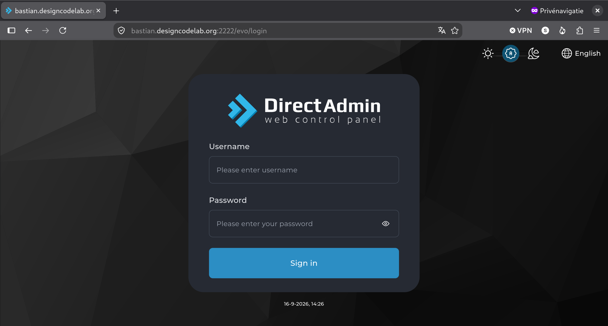

## DirectAdmin homepage

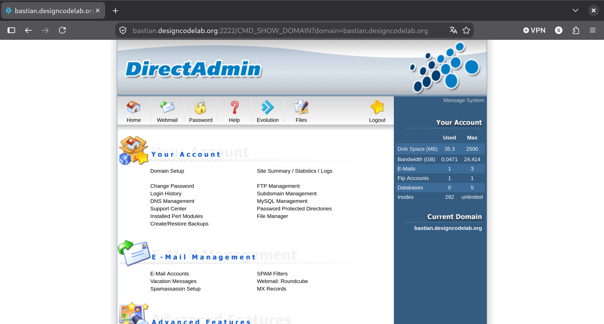

## Verder naar Evolution

Klik op

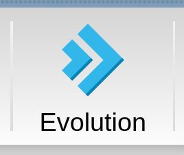

## Evolution scherm

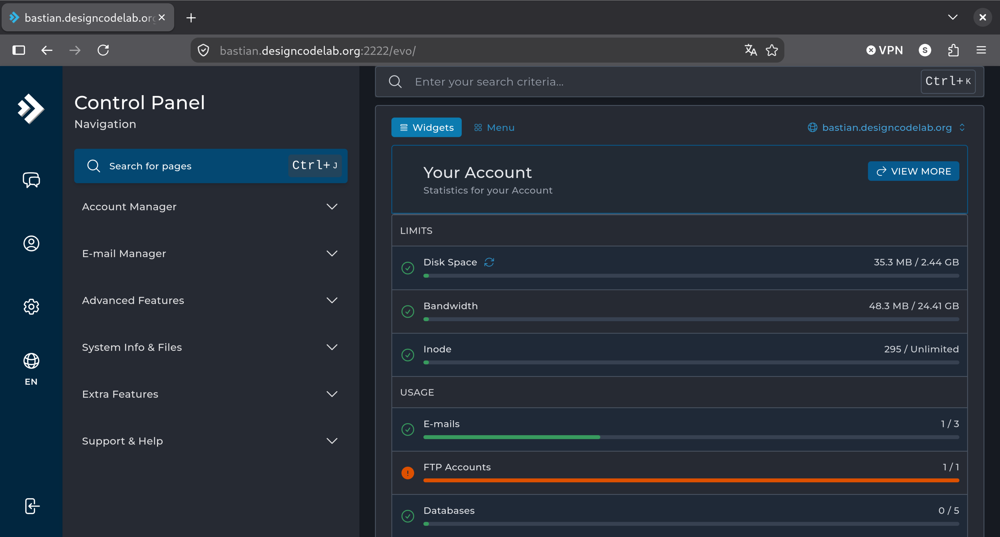

## Naar de WordPress Manager

Type `CTRL+J`

En type `Wordpress`

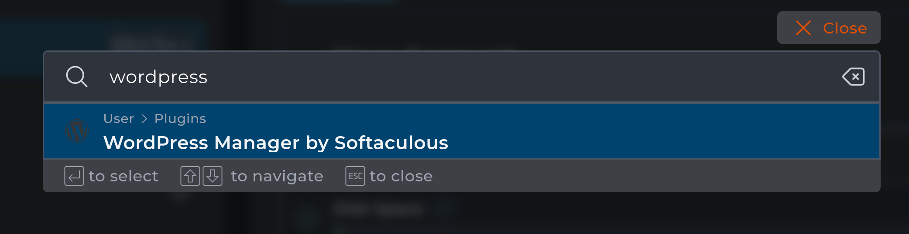

Druk op `ENTER`

## WordPress Manager

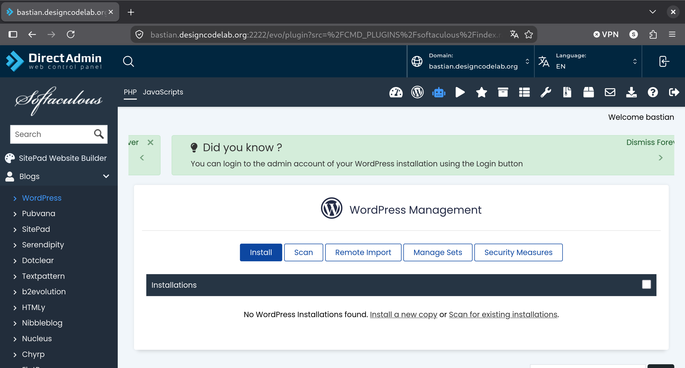

## Bewaar dit adres
 
Maak hier een bladwijzer van met `CTRL+D`

# SSL-certificaat maken

Om WordPress veilig te kunnen draaien heb je een SSL-certificaat nodig

## Ga naar DirectAdmin

`<mijn naam>.designcodelab.org:2222/`

## DirectAdmin homepage

## Ga naar SSL-Certificates

Klik op `SSL-Certificates` onder `Advanced Features`

## SSL-Certificates

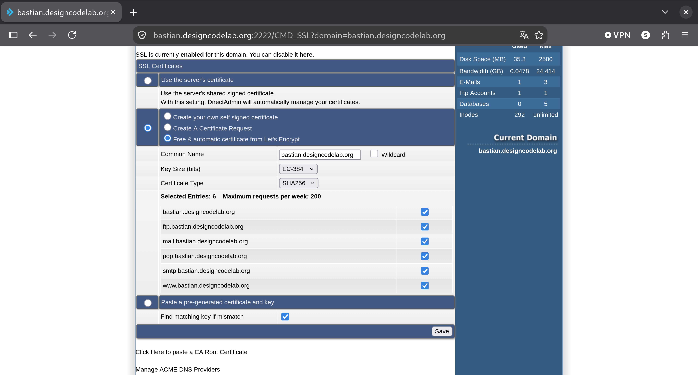

## SSL-Certificates gelukt

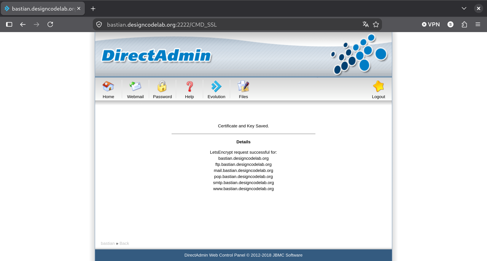

# Installeren van WordPress 

Ga naar [WordPress Manager](#naar-het-beheer) via je bladwijzer

## WordPress Manager

## Start installatie

Nadat je op `Install` hebt geklikt zie je
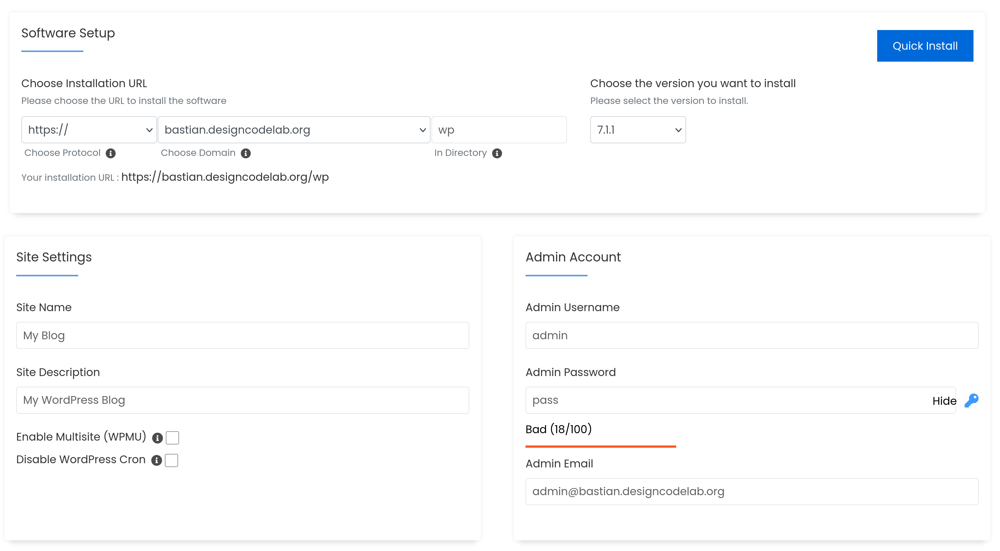

## Admin Account

Vul als `Admin Username` iets anders dan `admin` in.
Klik op het sleuteltje om een wachtwoord te genereren
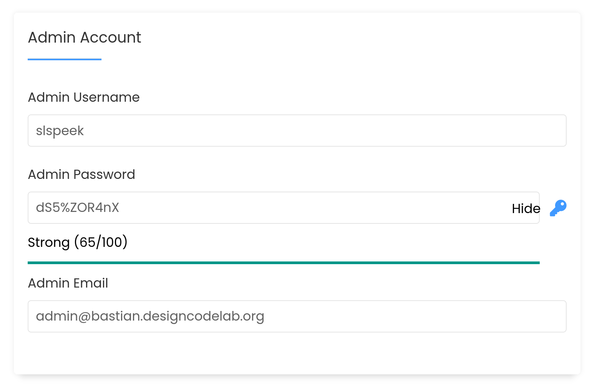

## Installeren

Nadat je de `Admin Account` gegevens hebt overgenomen,
druk je ondereen op `Install`
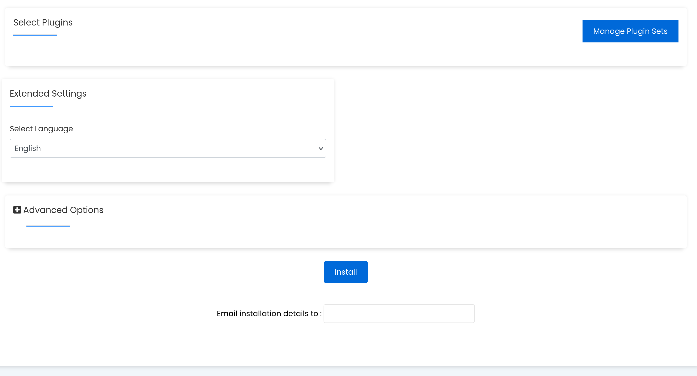

## Nieuwe site
Als de link naar je nieuwe site hebt geklikt zie je
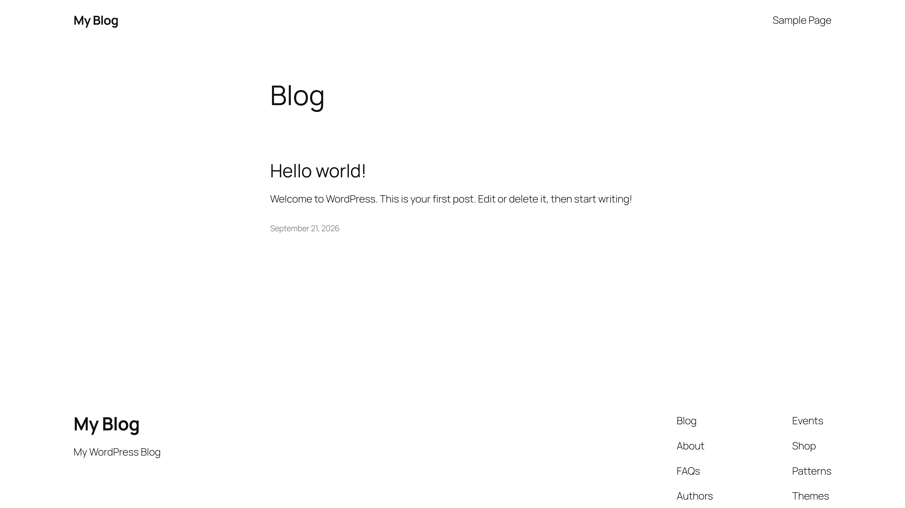

## Voortgang
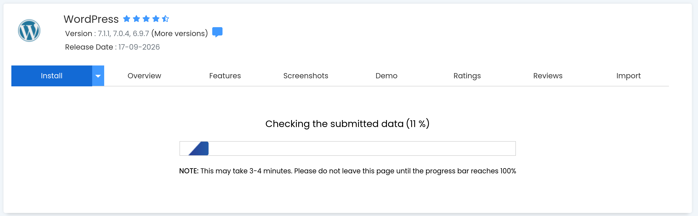

## Installatie voltooid
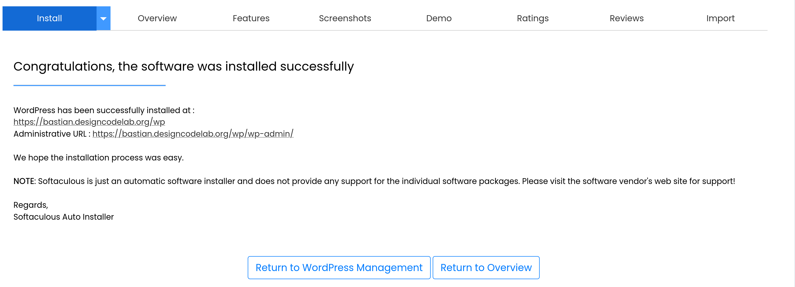

# Rondleiding door WordPress

## Dashboard

Je beheert hier

- Inhoud
- Vormgeving

## Inhoud

- Posts
- Pages

## Posts versus pages

Posts zijn dynamisch

Pages zijn statisch

## Posts

### Eigenschappen:

- Voeg je regelmatig toe
- Vaak getoond met de laatste bovenaan
- Kun je categorieën en tags aan toekennen

### Voorbeelden:

- Blog
- Nieuws
- Recepten

## Pages

### Eigenschappen:

- Tijdloos
- Vast aantal

### Voorbeelden:

- Start pagina
- Over ons
- Contact

## Aanmaken van posts en pages

- In de admin balk op "+ Nieuw"  drukken
- In het dashboard zij menu "Posts" -> "Add New Post"
- In het dashboard zij menu "Pages" -> "Add New Page"
