# Introductie WordPress
## Steven Speek

----

# Leerdoelen

- Een eigen domein opzetten
- [WordPress beginners cursus](https://learn.wordpress.org/course/beginner-wordpress-user/) kunnen volgen
- Iets op te zoeken met [Gemini AI](https://gemini.google.com/)

----

# Praktisch

- Bladwijzers en wachtwoorden sla je op in je Google account, door je aan te melden
in Google Chrome

- Om je AI-zoekopdrachten bewaar je door Gemini ingelogd te gebruiken

---

# Gemini AI

----

## Oefening

- Open Google Chrome: Druk <kbd><kbd><svg class="win-icon" xmlns="http://www.w3.org/2000/svg" viewBox="0 0 88 88" width="11" height="11"><path d="M0 12.402l35.687-4.86.016 34.423-35.67.203zm35.67 33.529l.028 34.453L.028 75.48.026 45.7zm4.326-39.025L87.314 0v41.527l-47.318.376zm47.329 39.349l-.011 41.34-47.318-6.678-.066-34.739z" fill="currentColor"/></svg></kbd></kbd> in en laat weer los, type `chro` en druk <kbd><kbd>Enter</kbd></kbd>
- Ga naar [Gemini AI](https://gemini.google.com)
    - <kbd><kbd>Ctrl</kbd>+<kbd>L</kbd></kbd>
    - type `gemini.google.com`

----

## Oefening

- Meld je aan in [Gemini AI](https://gemini.google.com)
- Vraag:
```
Hoe meld ik mij aan in Google Chrome
```
- Voer de instructies uit

<!-- ----

## Oefening

- Vraag aan [Gemini AI](https://gemini.google.com)
```
Hoe zorg ik ervoor dat ik Google Chrome
kan openen met WIN+1 onder MS Windows
```
- Voer de instructies uit
- Test of <kbd><kbd><svg class="win-icon" xmlns="http://www.w3.org/2000/svg" viewBox="0 0 88 88" width="11" height="11"><path d="M0 12.402l35.687-4.86.016 34.423-35.67.203zm35.67 33.529l.028 34.453L.028 75.48.026 45.7zm4.326-39.025L87.314 0v41.527l-47.318.376zm47.329 39.349l-.011 41.34-47.318-6.678-.066-34.739z" fill="currentColor"/></svg></kbd>+<kbd>1</kbd></kbd> Google Chrome opent -->

----

## Deze presentatie


`slspeek.github.io/intro-wordpress`

----

## Oefening

Maak een bladwijzer van de cursus
- In Google Crome druk je <kbd><kbd>Ctrl</kbd>+<kbd>L</kbd></kbd>
- Type 

`slspeek.github.io/intro-wordpress`

 en <kbd><kbd>Enter</kbd></kbd>
- Druk <kbd><kbd>Ctrl</kbd>+<kbd>D</kbd></kbd>

----

## Oefening

Maak een bladwijzer van [Gemini AI](https://gemini.google.com).

```
https://gemini.google.com
```

----

## Oefening

- Ga naar Gemini via je bladwijzer
- Vraag:
```
Hoe maak ik een mapje "cursus" op
de bladwijzerbalk in Google Chrome
```
- Voer de instructies uit
- Verplaats de bladwijzers naar dat mapje

----

## Oefening

- Ga naar [Gemini AI](https://gemini.google.com)
- Maak een nieuw `Notebook` aan onder de naam `WordPress cursus`
- Voeg aan de bronnen:
```
https://learn.wordpress.org
```
onder `Websites toevoegen` toe

`WordPress` onder `Gekopiëerde tekst` toe

----

## Oefening

Stel nu notebook `WordPress cursus` de vraag:
```
wat is het verschil tussen
een post en een page
```

---

# Wat is [WordPress](https://wordpress.org)?

- Wat kun je ermee bouwen?

----

## WordPress 

- WordPress is een open source contentmanagementsysteem
- Het wordt gebruikt voor websites, blogs, webwinkels en meer
- Inhoud en vormgeving worden afzonderlijk beheerd

----

## Oefening 

Schrijf je in op [learn.wordpress.org](https://login.wordpress.org/register)

----

## Oefening

1. Ga naar [Beginner WordPress User](https://learn.wordpress.org/course/beginner-wordpress-user/)
1. Maak daar een bladwijzer van in het "cursus" mapje
1. Volg de eerste les `Introduction to WordPress`

---

# Overzicht beheer

- Hoe bereik je het beheer
- SSL-certificaat maken
- Installatie

Later in de cursus:

- Back-up
- Verwijdering

---

# Naar het beheer

Ga met je browser naar

`<mijn naam>.designcodelab.org:2222/`

----

## Inloggen

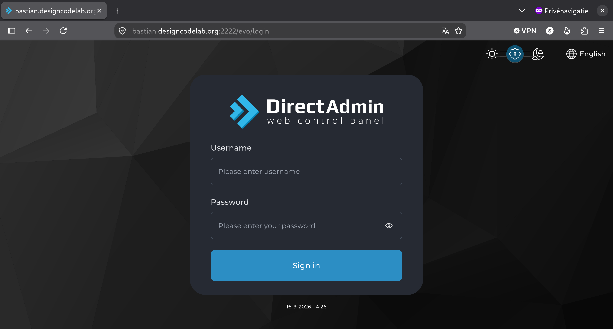

----

## DirectAdmin homepage

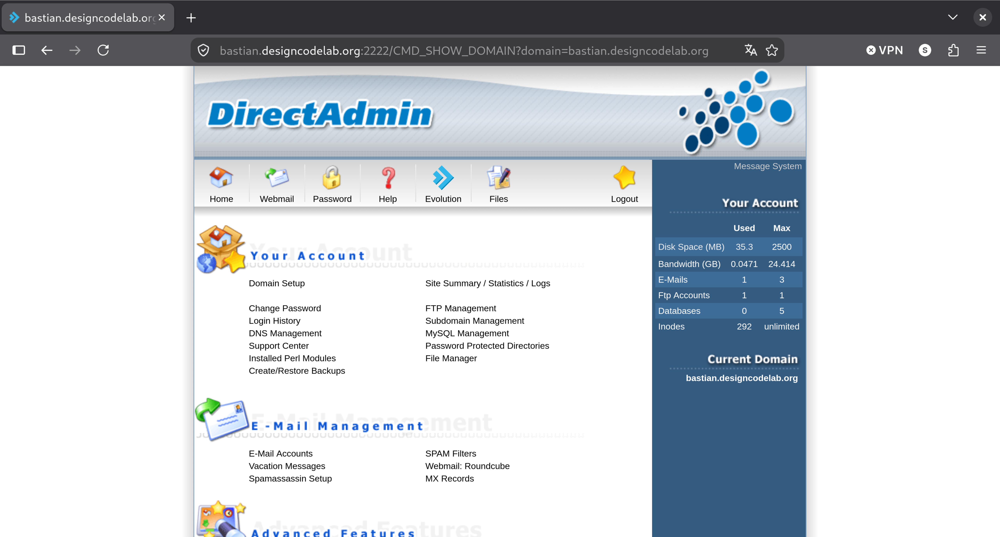

----

## Verder naar Evolution

Klik op

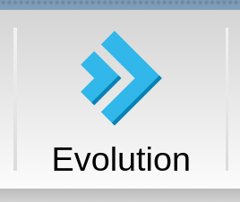

----

## Evolution scherm

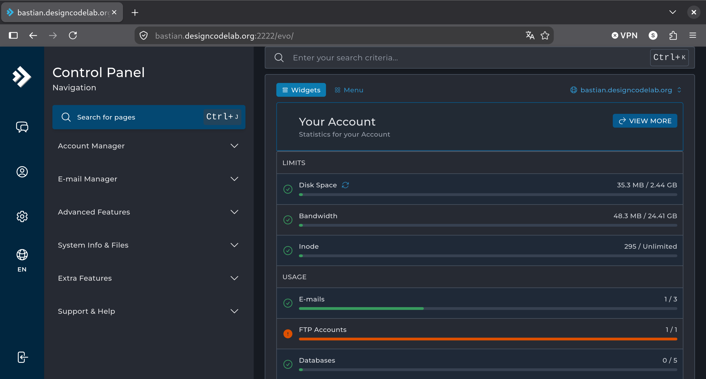

----

## Naar WordPress Manager

Druk op <kbd><kbd>Ctrl</kbd>+<kbd>J</kbd></kbd>, en type `Wordpress`

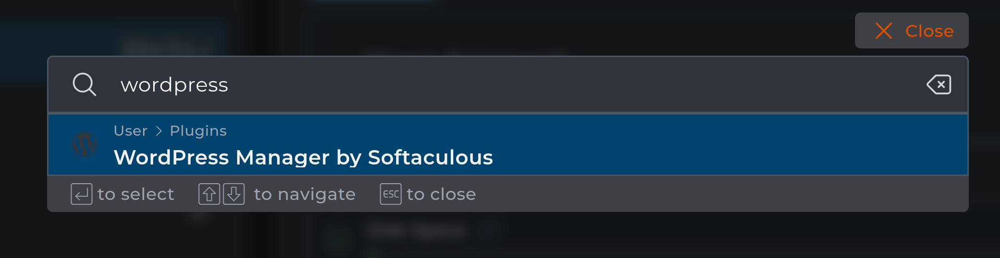

Druk op `ENTER`

----

## WordPress Manager

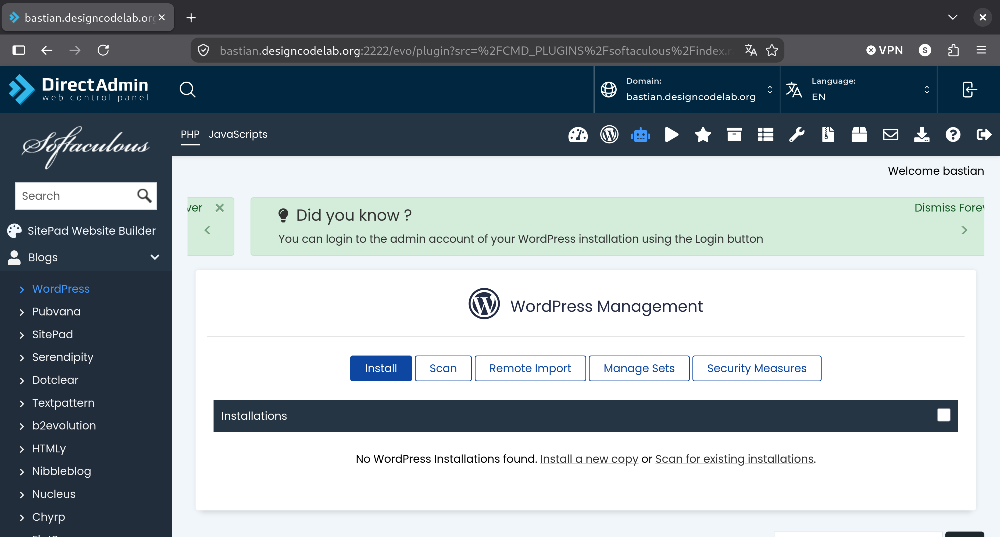

----

## Bewaar dit adres

Maak hier een bladwijzer van met <kbd><kbd>Ctrl</kbd>+<kbd>D</kbd></kbd>, deel de bladwijzer in het mapje cursus

---

# SSL-certificaat maken

Om WordPress veilig te kunnen draaien heb je een SSL-certificaat nodig

----

## Ga naar DirectAdmin

`<mijn naam>.designcodelab.org:2222/`

----

## DirectAdmin homepage


----

## Ga naar SSL-Certificates

Klik op `SSL-Certificates` onder `Advanced Features`

----

## SSL-Certificates

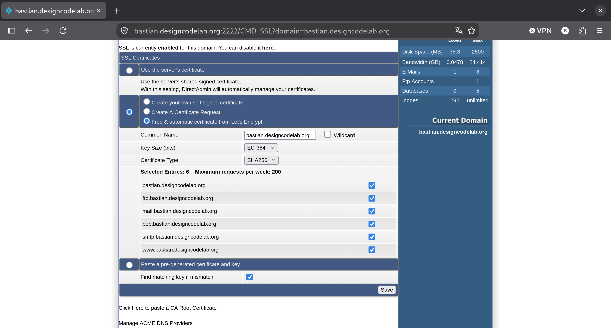

----

## SSL-Certificates gelukt

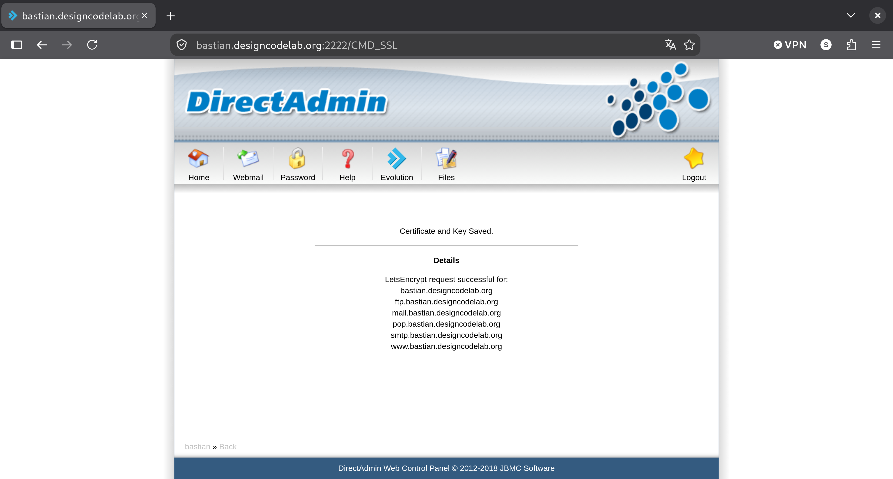

---

# Installeren van WordPress 

Ga naar [WordPress Manager](#naar-het-beheer) via je bladwijzer

----

## WordPress Manager


----

## Start installatie

Nadat je op `Install` hebt geklikt zie je
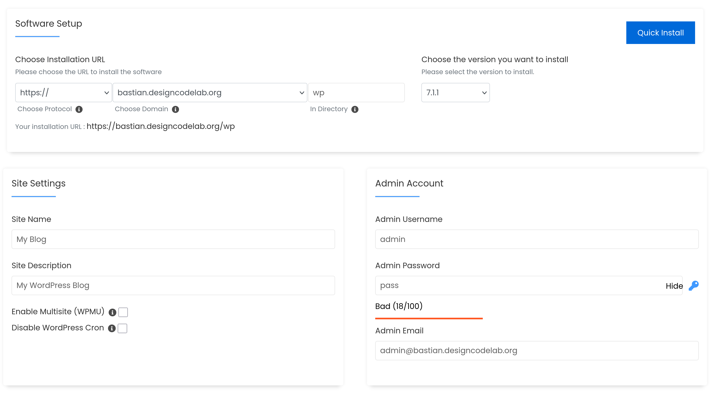

----

## Admin Account

Vul als `Admin Username` iets anders dan `admin` in.
Klik op het sleuteltje om een wachtwoord te genereren
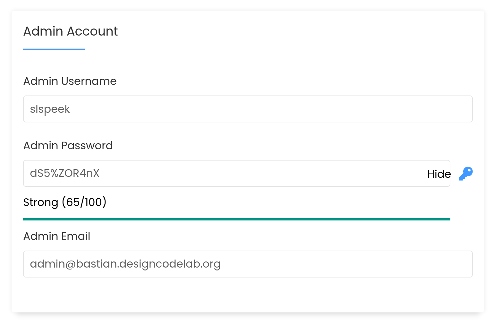

----

## Installeren

Nadat je de `Admin Account` gegevens hebt overgenomen,
druk je ondereen op `Install`
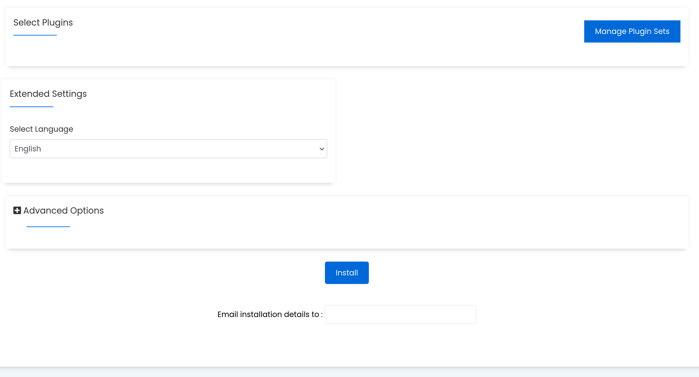


----

## Voortgang
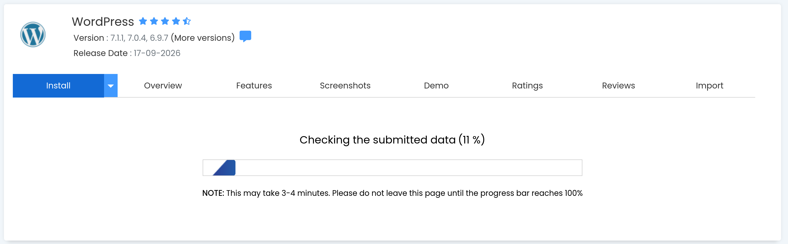

----

## Installatie voltooid
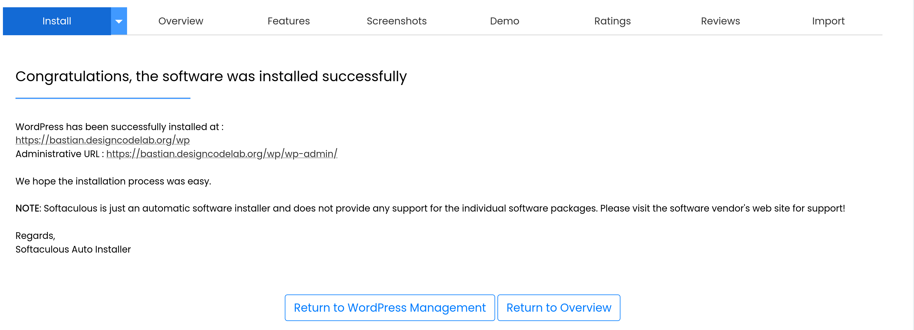

----

## Nieuwe site
Als de link naar je nieuwe site hebt geklikt zie je
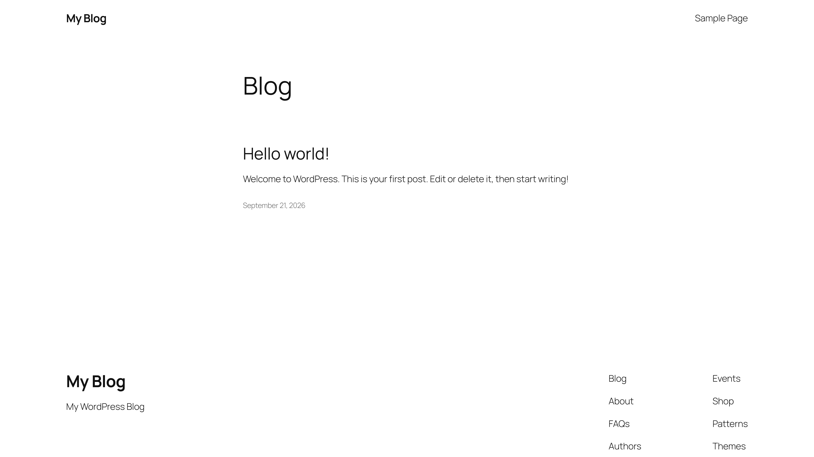

----

## Oefening

Bekijk de videoles [WordPress essentials: Domains and hosting](https://learn.wordpress.org/lesson/wordpress-essentials-domains-and-hosting/)

---

# Rondleiding door WordPress

----

## Dashboard

Je beheert hier

- Inhoud
- Vormgeving

----

## Inhoud

- Posts
- Pages

----

## Posts versus pages

Posts zijn dynamisch

Pages zijn statisch

----

## Posts

### Eigenschappen:

- Voeg je regelmatig toe
- Vaak getoond met de laatste bovenaan
- Kun je categorieën en tags aan toekennen

### Voorbeelden:

- Blog
- Nieuws
- Recepten

----

## Pages

### Eigenschappen:

- Tijdloos
- Vast aantal

### Voorbeelden:

- Start pagina
- Over ons
- Contact

----

## Aanmaken van posts en pages

- In de admin balk op "+ Nieuw"  drukken
- In het dashboard zij menu "Posts" -> "Add New Post"
- In het dashboard zij menu "Pages" -> "Add New Page"
